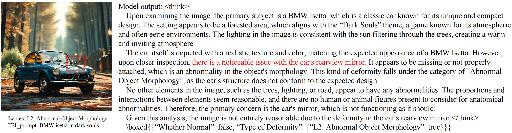

# MagicMirror: A Large-Scale Dataset and Benchmark for Fine-Grained Artifacts Assessment in Text-to-Image Generation

<p align="center">
    <a href="https://arxiv.org/abs/2509.10260" class="link-button"><strong>arXiv</strong></a> | 
    <a href="https://huggingface.co/datasets/wj-inf/MagicData340k" class="link-button"><strong>Dataset</strong></a> | 
    <a href="https://huggingface.co/wj-inf/MagicAssessor-7B" class="link-button"><strong>Model</strong></a> | 
    <a href="https://github.com/wj-inf/MagicMirror" class="link-button"><strong>Benchmark</strong></a>
</p>

<p align="center">
    <a href="https://scholar.google.com/citations?user=XtEtqU0AAAAJ&hl=en">Jia Wang</a><sup>1,2</sup>, 
    <a href="https://scholar.google.com/citations?hl=en&user=DAJdHnkAAAAJ">Jie Hu</a><sup>2†</sup>, 
    Xiaoqi Ma<sup>2</sup>, 
    Hanghang Ma<sup>2</sup>, 
    Yanbing Zeng<sup>2</sup>, 
    Xiaoming Wei<sup>2</sup>
</p>

<p align="center">
    <sup>1</sup>University of Chinese Academy of Sciences &nbsp;&nbsp;&nbsp; <sup>2</sup>Meituan
</p>

<p align="center">
    <sup>†</sup>Corresponding author
</p>

<p align="center">
    Contact: <code>wangj.infinite@gmail.com</code>, <code>hujiemr@gmail.com</code>
</p>

>
> We present **MagicMirror**, a comprehensive framework for artifacts assessment. We first establish a detailed taxonomy of generated image artifacts. Guided by this taxonomy, we manually annotate **MagicData340K**, the first human-annotated large-scale dataset of 340K generated images with fine-grained artifact labels. Building on this dataset, we train **MagicAssessor**, a Vision-Language Model (VLM) that provides detailed assessments and corresponding labels. We leverage MagicAssessor to construct **MagicBench**, an automated benchmark for evaluating the image artifacts of current T2I models.
<p align="center"></p>


## Setup Environment

```bash
git clone https://github.com/wj-inf/MagicMirror.git
cd MagicMirror
conda create -n MagicBench python=3.10 -y
conda activate MagicBench
pip install torch==2.6.0 torchvision==0.21.0 torchaudio==2.6.0 --index-url https://download.pytorch.org/whl/cu124
pip install vllm==0.8.5.post1
pip install accelerate deepspeed peft diffusers transformers protobuf tqdm Pillow pylatexenc mathruler
conda install -c conda-forge av -y
pip install qwen-vl-utils[decord]

pip uninstall -y numpy scipy
pip install numpy==1.24.3 scipy==1.10.1 pylatexenc
```


## Assess your own T2I models
Organize your image data as *./output/sdxl/merged_result_sdxl.jsonl*.
```bash
bash run.sh flux-schnell sdxl
```

## Results
| | Interaction Score | Human Score | Animal Score | Object Score | Overall Score |
| :--- | :--- | :--- | :--- | :--- | :--- |
| **FLUX.1-dev** | **84.71** | **46.00** | **44.50** | 89.60 | **62.16** |
| Seedream3.0 | 78.37 | 41.00 | <u>43.00</u> | **90.56** | <u>59.54</u> |
| Qwen-image | 79.01 | <u>44.15</u> | 40.70 | 87.85 | 59.41 |
| Hidream-l1 | 80.30 | 39.33 | 39.50 | <u>90.07</u> | 58.08 |
| FLUX.1-schnell | 79.90 | 37.67 | 39.00 | 86.49 | 56.03 |
| SD3.5 | 79.06 | 39.33 | 37.50 | 82.64 | 54.82 |
| Kolors1.0 | <u>82.56</u> | 39.46 | 40.50 | 75.44 | 52.82 |
| SD3 | 73.89 | 27.00 | 39.50 | 80.35 | 50.06 |
| SDXL | 76.02 | 32.33 | 39.00 | 74.30 | 49.36 |

| | Interaction Score | Human Score | Animal Score | Object Score | Overall Score |
| :--- | :--- | :--- | :--- | :--- | :--- |
| **GPT-image-1** | <u>81.54</u> | <u>45.00</u> | **49.00** | **91.41** | **63.08** |
| Bagel | **85.96** | 41.00 | <u>48.00</u> | <u>87.92</u> | <u>60.53</u> |
| Blip3-o | 79.57 | **46.33** | 43.00 | 81.27 | 57.98 |
| Janus-pro | 74.14 | 22.07 | 32.66 | 80.84 | 45.35 |
| Show-o | 74.49 | 23.33 | 30.50 | 76.41 | 44.77 |

## Citation
```bibtex
@article{wang2025magicmirror,
  title   = {MagicMirror: A Large-Scale Dataset and Benchmark for Fine-Grained Artifacts Assessment in Text-to-Image Generation},
  author  = {Wang, Jia and Hu, Jie and Ma, Xiaoqi and Ma, Hanghang and Zeng, Yanbing and Wei, Xiaoming},
  journal = {arXiv preprint arXiv:2509.10260},
  year    = {2025}
}
```
